# UI_INFORMATION_ARCHITECTURE.md — Information Architecture & User Flows

> The **structure** and the **movement**. This document defines how content is organized (IA) and
> how users move through it (user flows) for **API Testing Studio**. It is derived from
> `UI_BENCHMARK.md` (the UX foundation) and grounded in the real domain model. Read
> `UI_BENCHMARK.md` first for the *why*; this doc is the *what goes where* and *what happens next*.
> Items not yet built are labelled **(gap)**, consistent with the benchmark.

---

## Part 1 — Information Architecture

### IA principles (from the benchmark)

1. **Workspace is the root of everything.** All content is scoped to one open Workspace; there is
   no global, cross-workspace state except app preferences and recent-workspace pointers.
2. **Organize by the user's mental model, not the code's.** Group screens into a small set of
   *functional areas* a developer already recognizes (Explore APIs → Automate → Verify → Load →
   Analyze → Diagnose), each with a memorable home.
3. **One primary object per area; supporting objects hang off it.** APIs area centers on the
   Endpoint; Automate on the Workflow; Verify on the Test Case; Analyze on the Run.
4. **Stable spatial home for every content type.** Navigation lives left, work lives center,
   detail lives right, diagnostics live bottom, ambient state lives in the status bar
   (see `UI_BENCHMARK.md` → Dock Layout).
5. **Three routes to any content:** browse (tree/list), command (menu/toolbar/palette), and
   direct (quick-open by name). Findability is a first-class IA concern, not an afterthought.
6. **Consistent, unambiguous labels.** One term per concept, everywhere (see Labeling System).

### Content model (entity taxonomy)

Everything below lives inside a single Workspace (`.atsdb`). This is the authoritative content
map the navigation is built on.

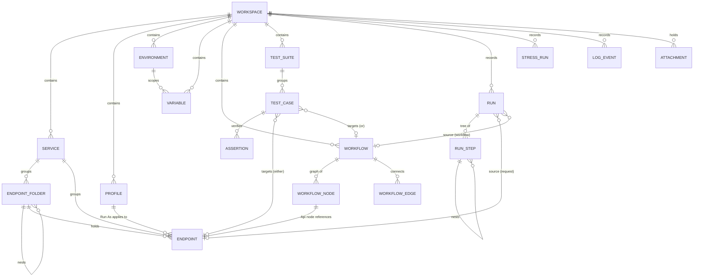

Key facts the IA must respect:
- **Endpoints** belong to a **Service** and optionally nest in self-nesting **Endpoint Folders**.
- **Variables** resolve across **six scopes** in precedence order: Global → Workspace →
  Environment → Workflow → Local → WorkflowOutput.
- **Exactly one Environment is active** per workspace; switching re-resolves env-scoped variables.
- **Profiles** are *roles*; "Run As" swaps auth per request/workflow/node.
- **Test Cases target either an Endpoint or a Workflow** — never both.
- **Runs are a unified tree** (`Run → RunStep`) shared by request, workflow, and stress sources;
  Dashboard, Timeline, and Replay all read it.

### Functional areas (the top-level IA)

The product collapses into **8 functional areas**. Each maps to an Activity-Rail entry
(**(gap)** — see `UI_BENCHMARK.md`), a default left/bottom home, and the documents it opens.

| # | Area | User intent | Primary object | Left/bottom home (tool) | Opens (document) |
|---|---|---|---|---|---|
| 1 | **APIs** | Explore & call endpoints | Endpoint | Service Explorer (left) | API Runner |
| 2 | **Workflows** | Automate multi-step calls | Workflow | Workflows panel (left) | Workflow Designer (1/workflow) |
| 3 | **Testing** | Verify behavior | Test Case | Test Cases panel (left) | Test Results |
| 4 | **Stress** | Load & measure | Stress plan | (launched from APIs/Workflows) | Stress Runner |
| 5 | **Analysis** | Understand activity | Run | (launched from menu/rail) | Dashboard · Timeline |
| 6 | **Logs** | Diagnose | Log event / Run | Log Viewer (bottom) | — (History inline in Runner) |
| 7 | **Identity** | Model who/where/what | Profile · Environment · Variable | Profiles panel (left) + toolbar switchers | editor dialogs |
| 8 | **Settings** | Configure the tool | Setting | — | Settings screen **(gap)**; Backup dialog today |

### Navigation model

Three tiers, following the benchmark's Dock Layout.

- **Primary navigation — Activity Rail (gap).** A thin icon strip switching the left panel between
  areas 1–3 and 7 (`Ctrl+1..5`). Gives each area a fixed home and one-key access.
- **Secondary navigation — trees & lists** inside the left tool panel (Service tree, Workflows
  list, Test Cases list, Profiles/Environments/Variables tabs) and **document tabs** across the
  center for open work surfaces.
- **Utility navigation — global & ambient:** Toolbar (workspace ops, Environment ▾, Profile ▾,
  Run, theme, search box), Menu, Status Bar (workspace · env · connection · task · last run),
  and the **Command Palette + Quick-Open (gap)** for keyboard-driven jumps.

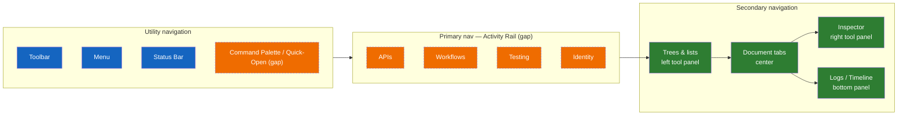

### Sitemap / screen inventory

Legend: **[✓]** implemented · **[gap]** recommended. Type: **Doc** = document pane ·
**Tool** = dockable tool pane · **Dialog** = modal · **Shell** = frame chrome.

```
Workspace  (.atsdb)                                                       Shell   [✓]
├─ Shell chrome: Menu · Toolbar · Status Bar                              Shell   [✓]
├─ Activity Rail                                                          Shell   [gap]
├─ Command Palette · Quick-Open · Global Search                           Shell   [gap]
│
├─ APIs
│  ├─ Service Explorer (Service→Folder→Endpoint, filter, context menu)    Tool    [✓]
│  └─ API Runner (Request Builder · Response Viewer · History)            Doc     [✓]
│
├─ Workflows
│  ├─ Workflows panel (list · new · open)                                 Tool    [✓]
│  └─ Workflow Designer (canvas · palette · node inspector)               Doc     [✓]
│
├─ Testing
│  ├─ Test Cases panel                                                    Tool    [✓]
│  └─ Test Results (pass/fail tree)                                       Doc     [✓]
│
├─ Stress
│  └─ Stress Runner (config · live metrics)                               Doc     [✓]
│
├─ Analysis
│  ├─ Dashboard (KPIs · charts · rankings · filters)                      Doc     [✓]
│  └─ Timeline (chronological runs · drill-down · replay)                 Doc     [✓]
│
├─ Logs
│  └─ Log Viewer (level/source/text filter)                              Tool    [✓]
│
├─ Identity
│  ├─ Profiles panel (Profiles · Environments · Variables tabs)          Tool    [✓]
│  ├─ Environment switcher (toolbar)                                      Shell   [✓]
│  └─ Profile / Environment / Variable editors                           Dialog  [✓]
│
├─ Import / Export
│  ├─ Import Wizard (cURL · OpenAPI · Swagger/URL · Scalar · Postman)     Dialog  [✓]
│  ├─ Export / Package (.apistudio)                                       Dialog  [✓]
│  └─ Backup & Restore                                                    Dialog  [✓]
│
├─ Attachments                                                            —       [gap]
└─ Settings (dedicated, searchable)                                       Doc     [gap]
```

### Labeling system & taxonomy

Consistency prevents the "same concept, two names" trap the benchmark warns against.

| Canonical term | Means | Do **not** call it |
|---|---|---|
| **Workspace** | The `.atsdb` root container | Project, Collection |
| **Service** | Base-URL grouping of endpoints | Collection, Folder |
| **Endpoint Folder** | Optional nesting under a Service | Group, Directory |
| **Endpoint** | One callable operation (verb + path) | Request, Route (in UI) |
| **Request** | A single *execution* of an endpoint in the Runner | Call, Hit |
| **Profile** | A role identity + encrypted credentials ("Run As") | User, Account, Auth |
| **Environment** | A named variable set; one active at a time | Stage, Config |
| **Variable** | `{{...}}` substitution value, scoped | Param, Setting |
| **Workflow** | A node-graph automation | Pipeline, Flow (in UI), Scenario |
| **Node** | One step in a workflow | Block, Action, Task |
| **Test Case** | A verifiable check on an endpoint or workflow | Test, Spec |
| **Assertion** | One expected condition on a response | Check, Rule |
| **Run** | A recorded execution (request/workflow/stress) | Result, Job, Session |
| **Stress Run** | A load execution + metrics | Benchmark, Perf test |

Iconography follows the Material set with a fixed concept↔icon mapping; HTTP verbs always use the
shared `HttpVerbToBrushConverter` badge across Explorer, Runner tabs, and workflow Api nodes.

### State & persistence model (what the IA remembers)

| State | Scope | Persisted where |
|---|---|---|
| Content (services, endpoints, workflows, tests, runs…) | Workspace | `.atsdb` SQLite |
| Active Environment | Workspace | Settings row `active-environment-id` |
| Dock layout | Per user (global) | `dock-layout.xml` |
| Theme (light/dark) | Per user | `AppSettings.ThemeMode` |
| Recent workspaces | Per user | recent-workspaces store |
| Open documents & last environment across sessions | Per workspace | **(gap)** — recommended |
| Named layout presets ("Design/Run/Analyse") | Per user | **(gap)** — recommended |

---

## Part 2 — User Flows

### Master flow — how the areas interconnect

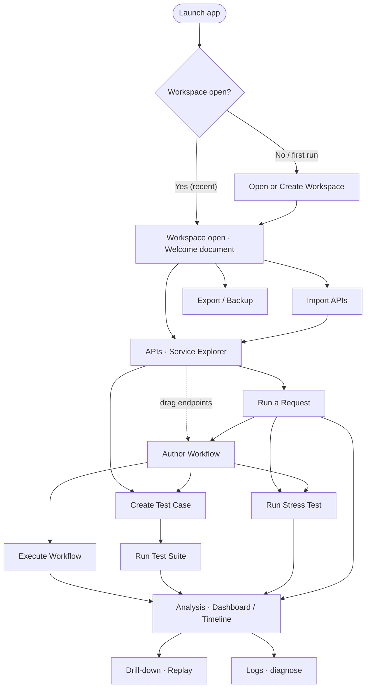

Cross-cutting selectors that apply to almost every flow: the **Environment ▾** and **Profile ▾**
toolbar switchers change how requests resolve variables and authenticate, without leaving the
current surface.

### Flow 1 — App launch & workspace selection

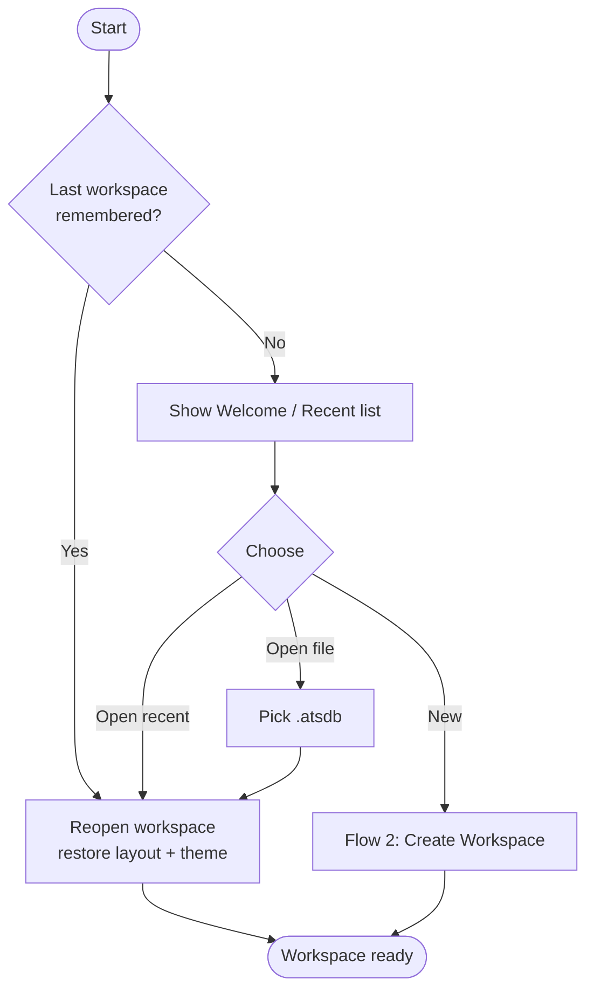

### Flow 2 — Create Workspace

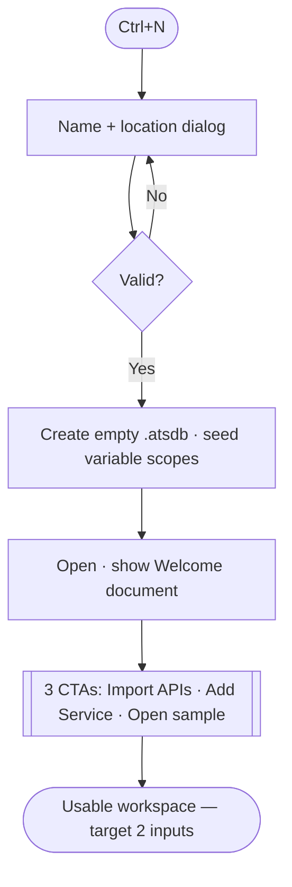

### Flow 3 — Import APIs (auto-detect)

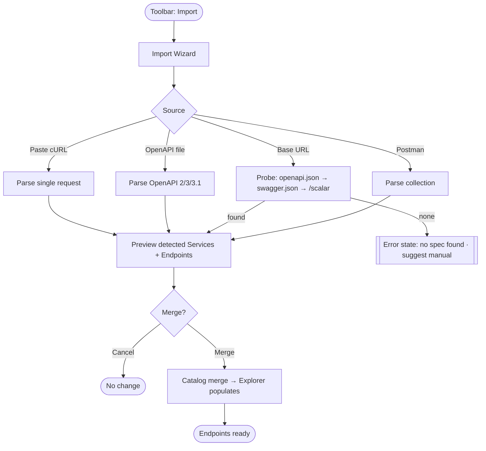

### Flow 4 — Run a Request

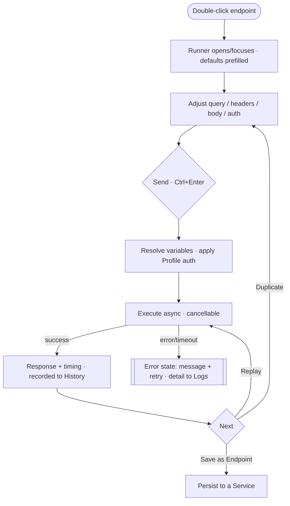

### Flow 5 — Create Workflow

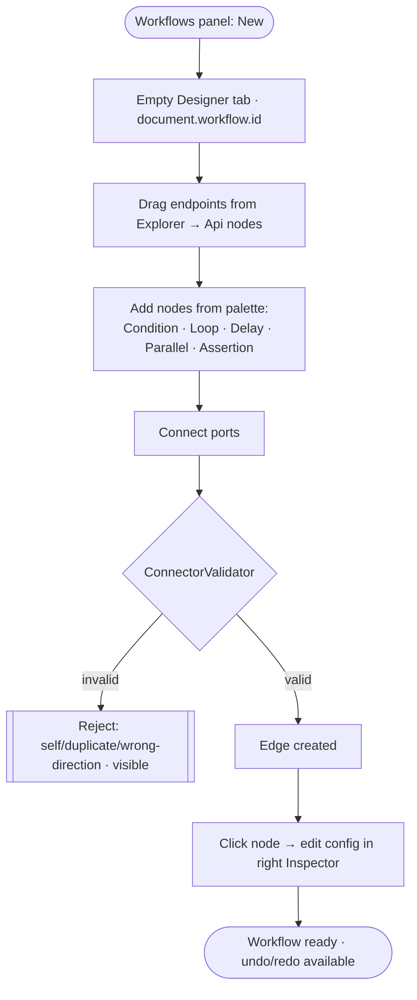

### Flow 6 — Execute Workflow

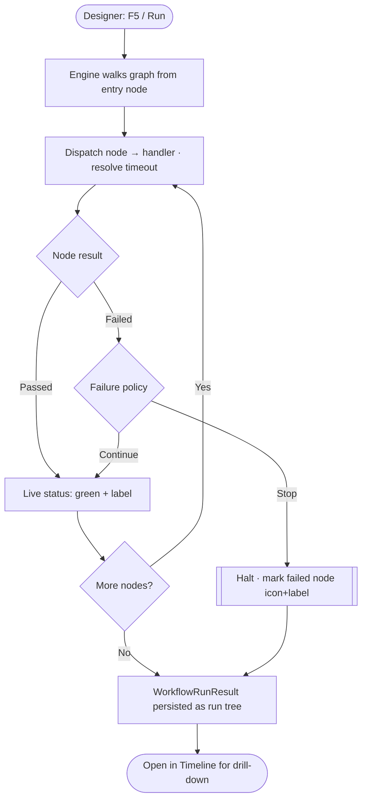

### Flow 7 — Create Test Case & run a suite

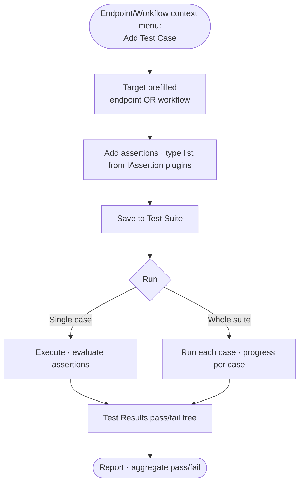

### Flow 8 — Run Stress Test

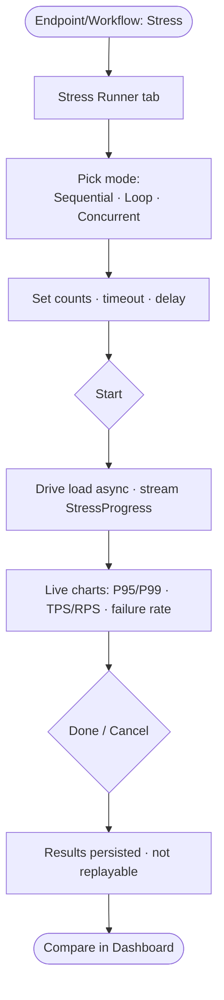

### Flow 9 — Analyze Dashboard → drill → replay

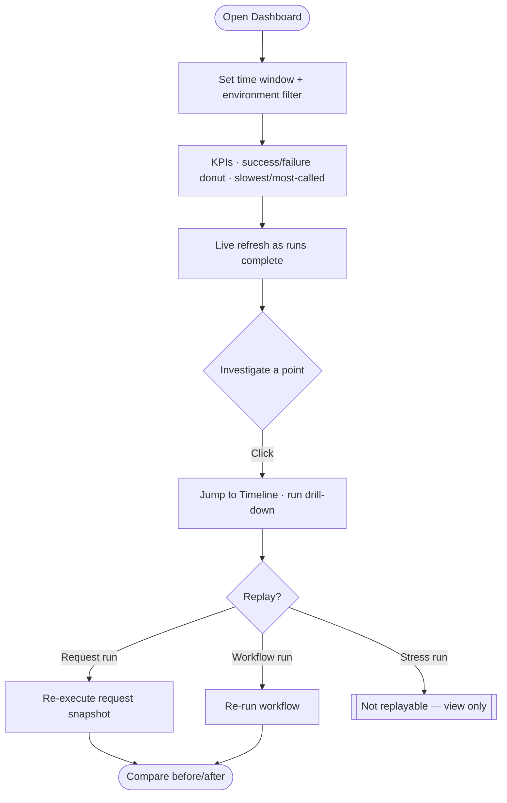

### Flow 10 — Export / Backup / Restore

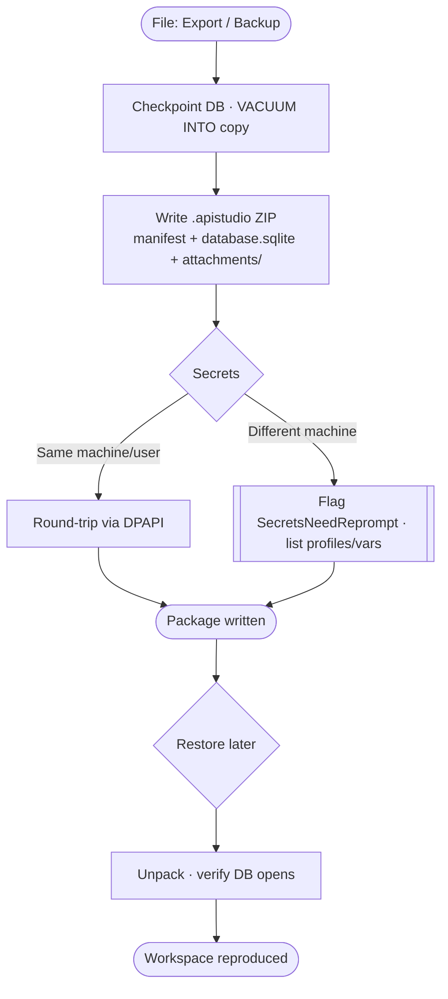

### Flow 11 — Cross-cutting: Environment switch & Profile "Run As"

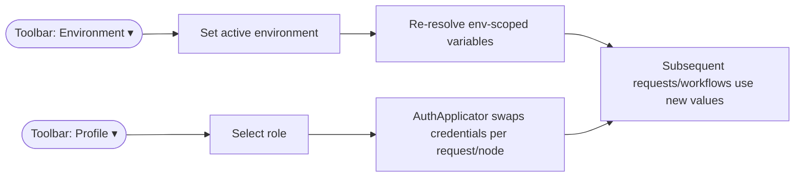

### Flow 12 — Command Palette & Quick-Open (gap)

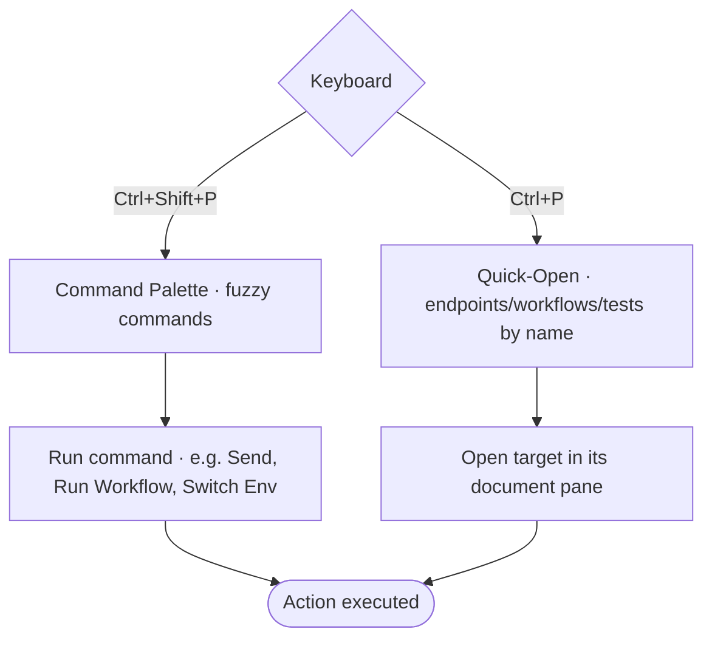

### Flow error/empty-state coverage

Every data surface defines the four states from `UI_BENCHMARK.md` (Empty · Loading · Error ·
Populated). In flow terms: an **empty** Explorer routes to Flow 3 (Import) or "Add Service"; a
**loading** request shows progress + cancel (Flow 4); an **error** surfaces inline with the next
action and pushes detail to the Logs panel; **populated** is the normal dense view.

---

## See also

- `UI_BENCHMARK.md` — UX foundation, dock layout, feature mapping, Top-20 improvements (the *why*).
- `UI_GUIDELINES.md` — WPF/MVVM/XAML rules (the *how*).
- `UI/DockLayout.md` · `UI/Explorer.md` · `UI/Runner.md` · `UI/WorkflowDesigner.md` ·
  `UI/Dashboard.md` · `UI/ProfilesAndEnvironments.md` — module implementation specs.
- `FEATURES/*` — feature-level behavior (Import, Workflow, TestCases, StressTesting, Logging,
  Packaging, Profiles, Environments, Variables, Runner, Dashboard).
- `CLAUDE.md` — project constitution and domain model.
